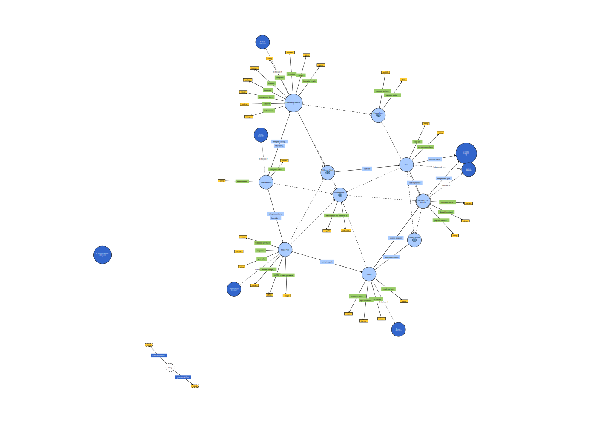

# Cardano Governance Knowledge Graph

A structured, queryable RDF knowledge graph of Cardano's on-chain governance ecosystem under [CIP-1694](https://cips.cardano.org/cip/CIP-1694) (Conway era). Built as part of the KEN4256 Individual Project at the Institute of Data Science, Maastricht University.

---

## Motivation

Cardano is the first major blockchain to deploy a formally specified liquid democracy framework at the protocol layer. Under CIP-1694, ADA holders delegate their voting power to Delegated Representatives (DReps), who vote on governance proposals ranging from treasury withdrawals to constitutional amendments and hard forks.

This data exists entirely on-chain, but it is fragmented across many API endpoints and object types with no unified, queryable structure. As a result, questions about governance health, voting power concentration, and participation quality require laborious endpoint-by-endpoint analysis.

This project addresses that gap. By modelling the Cardano governance ecosystem in RDF and exposing it via SPARQL, it becomes possible to ask relational questions that are impossible in flat data systems; such as which stake addresses delegate to both a pool *and* a DRep, which DReps hold disproportionate voting power relative to their delegator count, and which proposals were rejected and why.

---

## Knowledge Graph at a Glance

| Metric | Value |
|--------|-------|
| Total RDF triples | 1,590,142 |
| Epochs covered | 598–617 (20 epochs, ~100 days) |
| Stake pools | 100 |
| DReps | 1,593 |
| Stake addresses | 193,072 |
| Governance proposals | 91 |
| Votes | 21,923 |

**Download:** `governance_kg.ttl` and `ontology.ttl` are available in the [latest release](../../releases/latest).

---

## Ontology

Namespace: `cgov: <https://w3id.org/cgov#>`

The ontology defines six core classes (`DRep`, `StakePool`, `StakeAddress`, `Proposal`, `Vote`, `Epoch`), two SKOS concept schemes (proposal types and vote options), 11 object properties, and ~30 datatype properties. Established vocabularies reused: PROV-O, SKOS, OWL, schema.org, Dublin Core, FOAF.



---

## Repository Structure

```
cardanokb/
├── config.py               # API key, scope constants, rate limits
├── fetcher.py              # Paginated Blockfrost client with caching
├── fetch_epochs.py         # Epoch ingestion
├── fetch_pools.py          # Pool ingestion (details, metadata, delegators, history)
├── fetch_governance.py     # DRep + proposal ingestion (votes, delegators)
├── main.py                 # Pipeline orchestrator
├── build_ontology.py       # Generates ontology.ttl
├── json_to_rdf.py          # Transforms JSON cache → governance_kg.ttl
├── sparql_queries.ipynb    # All analytical SPARQL queries (Q1–Q8)
├── ontology.ttl            # OWL ontology file
└── query_results/          # CSV outputs from each query (Q1–Q8)
```

`governance_kg.ttl` and `cache/` are excluded from version control due to size. Both can be regenerated by following the steps below.

---

## Pipeline Architecture

```
Blockfrost API
      │
      ▼
fetcher.py  ──────────────────────────────────────────────┐
(paginated requests, exponential backoff, JSON cache)      │
      │                                                    │
      ├── fetch_epochs.py      → cache/epochs/            │
      ├── fetch_pools.py       → cache/pools/             │
      └── fetch_governance.py  → cache/dreps/             │
                                  cache/proposals/         │
                                  cache/votes/             │
                                                           │
                                                           ▼
                                               json_to_rdf.py
                                        (RDF transformation pipeline)
                                                           │
                                                           ▼
                                               governance_kg.ttl
                                            (1,590,142 RDF triples)
                                                           │
                                                           ▼
                                           sparql_queries.ipynb
                                          (analytical SPARQL queries)
```

The pipeline took approximately 2.3 hours to run due to Blockfrost API rate limiting. All API responses are cached to disk so subsequent runs are instantaneous.

---

## How to Reproduce

### 1. Install dependencies

```bash
pip install requests rdflib pandas
```

### 2. Set your Blockfrost API key

```bash
export BLOCKFROST_API_KEY="mainnetYOURKEYHERE"
```

Or set it directly in `config.py`.

### 3. Run the ingestion pipeline

```bash
python main.py
```

This fetches all data from Blockfrost and writes JSON cache files to `cache/`. Expect ~2 hours on first run.

### 4. Build the ontology

```bash
python build_ontology.py
```

Outputs `ontology.ttl`.

### 5. Transform to RDF

```bash
python json_to_rdf.py
```

Outputs `governance_kg.ttl`. Expect a few minutes.

### 6. Run the SPARQL queries

Open `sparql_queries.ipynb` in Jupyter. The notebook loads both TTL files via rdflib and runs all queries, saving results to `query_results/`.

```bash
jupyter notebook sparql_queries.ipynb
```

> **Note:** Queries run locally via rdflib. At 1.59M triples some queries (particularly Q7) take several minutes. For faster performance, load both TTL files into [Apache Jena Fuseki](https://jena.apache.org/documentation/fuseki2/) and point the notebook at your local SPARQL endpoint instead.

---

## SPARQL Query Examples

All queries use the following prefix declarations:

```sparql
PREFIX cgov:   <https://w3id.org/cgov#>
PREFIX rdf:    <http://www.w3.org/1999/02/22-rdf-syntax-ns#>
PREFIX skos:   <http://www.w3.org/2004/02/skos/core#>
PREFIX xsd:    <http://www.w3.org/2001/XMLSchema#>
```

### Top DReps by delegated voting power

```sparql
SELECT ?drep
       (ROUND(SUM(?lovelace) / 1000000) AS ?totalADA)
       (COUNT(?addr) AS ?delegators)
WHERE {
  ?addr rdf:type cgov:StakeAddress ;
        cgov:delegatesVotingPowerTo ?drep ;
        cgov:delegatedStakeLovelace ?lovelace .
  ?drep rdf:type cgov:DRep .
}
GROUP BY ?drep
ORDER BY DESC(?totalADA)
LIMIT 10
```

### DRep participation gap

```sparql
SELECT (COUNT(?drep) AS ?count) ?hasVoted
WHERE {
  ?drep rdf:type cgov:DRep .
  BIND(EXISTS { ?drep cgov:castVote ?v . } AS ?hasVoted)
}
GROUP BY ?hasVoted
```

### Proposal vote breakdown

```sparql
SELECT ?proposal ?proposalType
       (SUM(IF(?opt = cgov:Yes,     1, 0)) AS ?yes)
       (SUM(IF(?opt = cgov:No,      1, 0)) AS ?no)
       (SUM(IF(?opt = cgov:Abstain, 1, 0)) AS ?abstain)
WHERE {
  ?vote rdf:type cgov:Vote ;
        cgov:voteOnProposal ?proposal ;
        cgov:hasVoteOption ?opt .
  OPTIONAL {
    ?proposal cgov:hasProposalType ?typeNode .
    ?typeNode skos:prefLabel ?proposalType .
  }
}
GROUP BY ?proposal ?proposalType
ORDER BY DESC(?yes)
```

The full set of 8 queries with results is in `sparql_queries.ipynb` and `query_results/`.

---

## Key Findings

- **AlwaysAbstain controls ~26.8% of active stake** (5.71 billion ADA across 106,400 delegators), most likely driven by custodial platforms delegating on behalf of users to satisfy CIP-1694's reward withdrawal requirements.
- **54.5% of registered DReps have never voted**, revealing a significant gap between formal registration and active governance participation.
- **The governance system functions as a check** - multiple proposals including treasury withdrawals and info actions were rejected with strong No majorities, demonstrating substantive DRep scrutiny.
- **Whale delegation is measurable** - one DRep accumulated 292 million ADA from just 90 delegators (~3.25M ADA per delegator on average).

---

## FAIR Compliance

| Principle | Implementation |
|-----------|---------------|
| Findable | Persistent `w3id.org` namespace; registered on Google Dataset Search |
| Accessible | Graph files hosted via GitHub Releases; GitHub Pages site |
| Interoperable | Reuses PROV-O, SKOS, OWL, schema.org, Dublin Core |
| Reusable | Provenance triples on every entity (`retrievedFromEndpoint`, `retrievedAt`) |

---

## Citation

If you use this dataset or ontology, please cite:

```
Mawocha, T. (2026). A Knowledge Graph of Cardano On-Chain Governance.
KEN4256 Individual Project, Institute of Data Science, Maastricht University.
https://github.com/tmawocha/cardanokb
```

---

## License

MIT License - see `LICENSE` for details.
